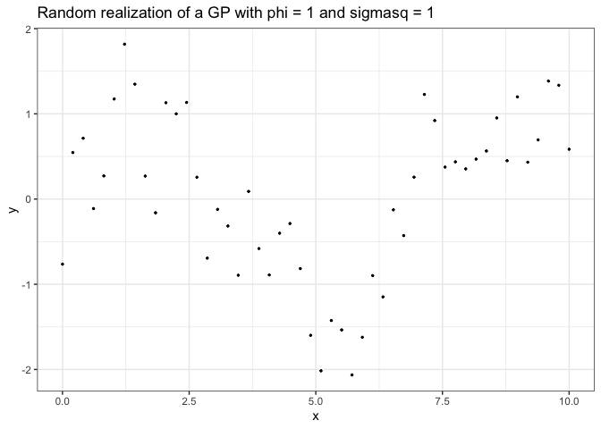
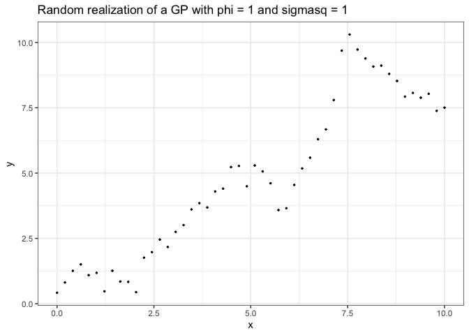

# Week 10: Activity


### Last Week’s Recap

- GPs in 2D
- Bayesian inference with `stan`

### This week

- Fitting GP models

#### Conditional Normal distribution

Continuing the theme from last week, now there is one more location that
we are interested in learning the temperature, maybe Rendezvous Ski
Trails in West Yellowstone.

Let’s assume that
$$\begin{bmatrix} y_{bridger}\\ y_{big sky}\\ y_{rendezvous} \end{bmatrix} \sim N(\begin{bmatrix} 15 \\ 15 \\ 15\end{bmatrix}, 100\begin{bmatrix} 1 & .3 & .2 \\ .3 & 1 & .5 \\ .2 & .5 & 1
\end{bmatrix})$$

###### 1. Simulate one data point for Bridger and Big Sky

Simulate a single realization from the distribution for Bridger and Big
Sky (ignoring Rendezvous for now).

###### 2. Estimate Rendezvous, conditional on the data point from Bridger and Big Sky

#### GP in 1D

Recall our simulated Gaussian process in 1D

``` r
phi <- 1
sigmasq <- 1
n <- 50
x <- seq(0, 10, length.out = n)
d <- sqrt(plgp::distance(x))
eps <- sqrt(.Machine$double.eps) 
H <- exp(-d/phi) + diag(eps, n) 
y <- rmnorm(1, rep(0,n),sigmasq * H)
tibble(y = y, x = x) %>% ggplot(aes(y=y, x=x)) +
  theme_bw() + ggtitle('Random realization of a GP with phi = 1 and sigmasq = 1') +
  geom_point(size = .5)
```



We have simulated y ~ N(mu, sigmasq \* H(phi)), where H(phi) is a
correlation matrix from exp(-d/phi).

##### STAN CODE

Let’s first explore stan code to estimate phi, sigmasq and mu

    data {
      int<lower=0> N; // number of data points
      vector[N] y; // responds
      matrix[N,N] dist; // distance matrix
    }

    parameters {
      real<lower = 0.5, upper = 9.8> phi;
      real<lower = 0> sigmasq;
      real mu;
    }

    transformed parameters{
      vector[N] mu_vec;
      corr_matrix[N] Sigma;
      
      for(i in 1:N) mu_vec[i] = mu;
      for(i in 1:(N-1)){
       for(j in (i+1):N){
         Sigma[i,j] = exp((-1)*dist[i,j]/ phi);
         Sigma[j,i] = Sigma[i,j];
       }
     }
     
     for(i in 1:N) Sigma[i,i] = 1;

    }

    model {
      y ~ multi_normal(mu_vec ,sigmasq * Sigma);
      phi ~ inv_gamma(10,10);
      sigmasq ~ inv_gamma(10,10);
      mu ~ normal(0, 10);
    }

Fit and summarize this model.

#### GP regression in 1D

Now add a covariate

``` r
phi <- 1
sigmasq <- 1
n <- 50
x <- seq(0, 10, length.out = n)
beta <- 1
d <- sqrt(plgp::distance(x))
eps <- sqrt(.Machine$double.eps) 
H <- exp(-d/phi) + diag(eps, n) 
y <- rmnorm(1, x * beta,sigmasq * H)
reg_fig <- tibble(y = y, x = x) %>% ggplot(aes(y=y, x=x)) +
  theme_bw() + ggtitle('Random realization of a GP with phi = 1 and sigmasq = 1') +
  geom_point(size = .5)
reg_fig
```



We have simulated y ~ N(mu, sigmasq \* H(phi)), where H(phi) is a
correlation matrix from exp(-d/phi).

##### STAN CODE

    data {
      int<lower=0> N; // number of data points
      vector[N] y; // response
      matrix[N,N] dist; // distance matrix
      vector[N] x; // covariate
    }

    parameters {
      real<lower = 0.5, upper = 9.8> phi;
      real<lower = 0> sigmasq;
      real beta;
    }

    transformed parameters{
      vector[N] mu_vec;
      corr_matrix[N] Sigma;
      
      for(i in 1:N) mu_vec[i] = x[i] * beta;
      for(i in 1:(N-1)){
       for(j in (i+1):N){
         Sigma[i,j] = exp((-1)*dist[i,j]/ phi);
         Sigma[j,i] = Sigma[i,j];
       }
     }
     for(i in 1:N) Sigma[i,i] = 1;

    }

    model {
      y ~ multi_normal(mu_vec ,sigmasq * Sigma);
      phi ~ inv_gamma(10,10);
      sigmasq ~ inv_gamma(10,10);
      beta ~ normal(0, 10);
    }

Fit and summarize this model.

##### Making Predictions

For today, consider “plug in” estimates of phi, mu, and sigmasq. To make
predictions from -1 to 11. Include both a mean and some measure of
uncertainty.
