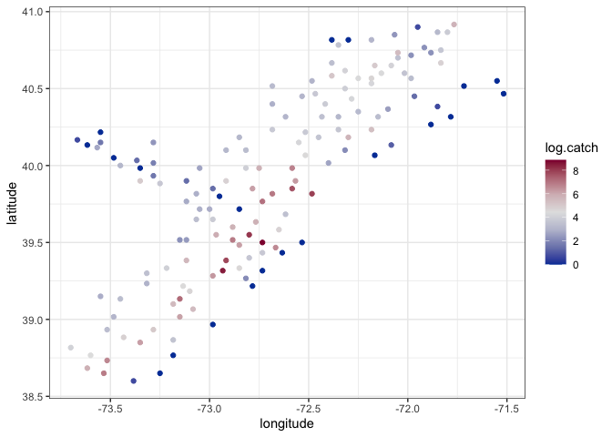

# Week 11: Activity Key

### Last Week’s Recap

- fitting GP models
- Spatial predictions
- Variograms

### This week

- Spatial EDA
- GP models to spatial data
- Spatial Prediction / Model Choice

------------------------------------------------------------------------

# Exploratory Data Analysis

## EDA Overview

- Exploratory Data Analysis (EDA) is commonly used to explore and
  visualize data sets.
- EDA is not a formal analysis, but can inform modeling decisions.
- What are we interested in learning about with spatial data?

## Data Decomposition: Time Series

- In time series analysis, the first step in the EDA process was to
  decompose the observed data into a trend, seasonal cycles, and a
  random component.

## Data Decomposition: Spatial Data

- Similarly spatial data will be decomposed into the mean surface and
  the error surface.

- For example, elevation and distance from major bodies of water would
  be part of the mean surface for temperature.

- The mean surface is focused on the global, or first-order, behavior.

- The error surface captures local fluctuations, or second-order,
  behavior.

- Spatial structure in the response surface and spatial structure in the
  error surface are not one-and-the-same.

- Data sets contain two general types of useful information: spatial
  coordinates and covariates.

- Regression models will be used to build the mean surface.

## Spatial EDA Overview

1.  Map of locations
2.  Histogram or other distributional figures
3.  3D scatterplot
4.  General Regression EDA
5.  Variograms and variogram clouds
6.  Anistopic diagnostics

Then model fitting & diagnostics follow…

# Scallops Data Example

Consider the `scallop` dataset collected in 1990 of the coast of Long
Island.

## 1. Map of Locations

## 1. Map of Locations - Takeaways

*Goal*: Understand the sampling approach

- Is this a grid?
- Are there directions that have larger distances?
- How large is the spatial extent?



## 2. Histogram

## 2. Histogram - Takeaways

*Goal:* Identify a sampling distribution for the data

- Continuous or discrete data
- A linear model approach will be used for the response
- Spatial structure can also be included in generalized linear models
- Outliers are worth investigating, but a data point that does not fit
  the assumed model should not automatically be eliminated



## 3. 3D scatterplot

## 3. 3D scatterplot - Takeaways

*Goal:* Examine the spatial pattern of the response

- Again, this is the response not the residual
- Can also think about a contour plot (using some interpolation method)

## 4. General Regression EDA

- Assessing relationship between variable of interest and covariate
  information
- No covariates are present in the scallops data
- In some cases latitude and longitude can be used as covariates

## 5. Variograms and variogram clouds

## 5. Variograms

## 5. Variograms: Takeaways

*Goal:* Visually diagnose spatial structure

## 6. Anisotropy

*Goal:* Determine if direction influences spatial structure

## Directional Variogram

- All of the variograms we have looked at are isotropic

------------------------------------------------------------------------

## Model fitting

There are several paradigms for model selection. Here we will motivate
using a test & training set to compare predictions from a spatial and
non-spatial model.

On the test set, compare root mean squared error (RMSE)
$\sqrt{\sum_i(y_i - y_{i,pred})^2 / n}$ and mean absolute deviation
(MAD) $\sum_i|y_i - y_{i,pred}| / n$

#### 1. Create a test and training set from the scallop dataset. Then create a visual to show the test / training datasets.

I’d recommend using ~100 to fit your model (training set) and ~50 for
prediction (test set).

2.  Write code to estimate a non-spatial model using just the mean
    structure. Then construct a figure that includes mean predictions
    for each site in the test dataset.

**Write out the model that corresponds to the stan code below.**

*This is a boring model where $\text{log_scallops} = \mu + \epsilon,$
where $\epsilon \sim N(0, \tau^2)$*

    data {
      int<lower=0> N; // number of observed data points 
      vector[N] y; // observed response
      int<lower=0> N_preds; // number of predictive points
    }

    parameters {
      real<lower = 0> tausq;
      real mu;
    }

    transformed parameters{
      vector[N] mu_vec;
      vector[N] tausq_vec;
      for(i in 1:N) mu_vec[i] = mu;
      for(i in 1:N) tausq_vec[i] = tausq;
    }

    model {
      y ~ multi_normal(mu_vec ,diag_matrix(tausq_vec));
      mu ~ normal(0, 10);
      
    }

    generated quantities {
      vector[N_preds] y_preds;
      vector[N_preds] mu_preds;
      vector[N_preds] tausq_preds;

      for(i in 1:N_preds) mu_preds[i] = mu;
      for(i in 1:N_preds) tausq_preds[i] = tausq;

      y_preds = multi_normal_rng(mu_preds, diag_matrix(tausq_preds));
    }

    Trying to compile a simple C file

    Inference for Stan model: anon_model.
    4 chains, each with iter=5000; warmup=2500; thin=1; 
    post-warmup draws per chain=2500, total post-warmup draws=10000.

               mean se_mean   sd  2.5%  25%  50%  75% 97.5% n_eff Rhat
    mu         3.59    0.00 0.22  3.16 3.44 3.59 3.74  4.03  7764    1
    tausq      5.10    0.01 0.75  3.84 4.58 5.03 5.54  6.76  7533    1
    y_preds[1] 3.58    0.02 2.28 -0.85 2.05 3.56 5.12  8.13  9526    1
    y_preds[2] 3.59    0.02 2.26 -0.84 2.07 3.59 5.09  8.06  9898    1
    y_preds[3] 3.58    0.02 2.28 -0.91 2.06 3.56 5.06  8.11  9665    1

    Samples were drawn using NUTS(diag_e) at Tue Apr  1 11:45:43 2025.
    For each parameter, n_eff is a crude measure of effective sample size,
    and Rhat is the potential scale reduction factor on split chains (at 
    convergence, Rhat=1).

3.  Now fit a model with spatial structure and construct a figure that
    includes mean predictions for each site in the test dataset.

<!-- -->

    data {
      int<lower=0> N; // number of observed data points 
      vector[N] y; // observed response
      matrix[N,N] dist; // observed distance matrix
      real phi_lower; // lower point for phi (range)
      real phi_upper; // upper point for phi (range)
      int<lower=0> N_preds; // number of predictive points
      matrix[N_preds,N_preds] dist_preds; // distance matrix for predictive points
      matrix[N, N_preds] dist_12; //distance between observed and predicted
      real phi_a;
      real phi_b;
      real sigmasq_a;
      real sigmasq_b;
      real tausq_a;
      real tausq_b;
    }

    parameters {
      real<lower = phi_lower, upper = phi_upper> phi;
      real<lower = 0> sigmasq;
      real<lower = 0> tausq;
      real mu;
    }

    transformed parameters{
      vector[N] mu_vec;
      vector[N] tausq_vec;
      corr_matrix[N] Sigma;
      
      for(i in 1:N) mu_vec[i] = mu;
      for(i in 1:(N-1)){
       for(j in (i+1):N){
         Sigma[i,j] = exp((-1)*dist[i,j]/ phi);
         Sigma[j,i] = Sigma[i,j];
       }
     }
     for(i in 1:N) Sigma[i,i] = 1;
     for(i in 1:N) tausq_vec[i] = tausq;
    }

    model {
      matrix[N, N] L;
      L = cholesky_decompose(sigmasq * Sigma + diag_matrix(tausq_vec));

      y ~ multi_normal_cholesky(mu_vec, L);
      phi ~ inv_gamma(phi_a, phi_b);
      sigmasq ~ inv_gamma(sigmasq_a, sigmasq_b);
      tausq ~ inv_gamma(tausq_a, tausq_b);
      mu ~ normal(0, 10);
    }

    generated quantities {
      vector[N_preds] y_preds;
      vector[N] y_diff;
      vector[N_preds] mu_preds;
      corr_matrix[N_preds] Sigma_preds;
      vector[N_preds] tausq_preds;
      matrix[N, N_preds] Sigma_12;

      for(i in 1:N_preds) tausq_preds[i] = tausq;
      for(i in 1:N_preds) mu_preds[i] = mu;
      for(i in 1:N) y_diff[i] = y[i] - mu;
      

      for(i in 1:(N_preds-1)){
       for(j in (i+1):N_preds){
         Sigma_preds[i,j] = exp((-1)*dist_preds[i,j]/ phi);
         Sigma_preds[j,i] = Sigma_preds[i,j];
       }
     }
     for(i in 1:N_preds) Sigma_preds[i,i] = 1;
     
       for(i in 1:(N)){
       for(j in (1):N_preds){
         Sigma_12[i,j] = exp((-1)*dist_12[i,j]/ phi);
       }
     }

    y_preds = multi_normal_rng(mu_preds + (sigmasq * Sigma_12)' * inverse(sigmasq * Sigma) * (y_diff), sigmasq * Sigma_preds + diag_matrix(tausq_preds) - (sigmasq * Sigma_12)' * inverse(sigmasq * Sigma + diag_matrix(tausq_vec)) * (sigmasq * Sigma_12) );
    }

**What is the statistical model implied by this stan code?**

*Now $\text{log_scallops} = \mu + \epsilon,$ where
$\epsilon \sim N(0, \sigma^2 H(\phi|d) + \tau^2 I)$* and
$H(\phi|d)_{ij} = \exp(d_{ij}/\phi)$

**Discuss the parameter fits from this code.**

    Trying to compile a simple C file

*The magnitude of $\sigma$ (the partial sill) is substantially bigger
than $\tau$ (the nugget), suggesting that spatial covariance in the data
is fairly strong. The range parameter, $\phi$ is fairly small on the
scale of the data. These parameters seem fairly reasonable based on the
data.*

    Inference for Stan model: anon_model.
    2 chains, each with iter=2000; warmup=1000; thin=1; 
    post-warmup draws per chain=1000, total post-warmup draws=2000.

               mean se_mean   sd  2.5%   25%  50%  75% 97.5% n_eff Rhat
    mu         2.39    0.04 1.04 -0.11  1.87 2.52 3.05  4.08   623 1.00
    sigmasq    6.33    0.13 2.77  2.96  4.50 5.69 7.47 12.87   474 1.01
    tausq      0.85    0.01 0.38  0.36  0.57 0.77 1.06  1.76  1059 1.00
    phi        0.36    0.01 0.18  0.17  0.25 0.32 0.42  0.82   435 1.01
    y_preds[1] 1.06    0.04 1.89 -2.65 -0.19 1.02 2.33  4.73  2054 1.00
    y_preds[2] 1.81    0.04 2.00 -2.14  0.47 1.83 3.15  5.72  2129 1.00
    y_preds[3] 0.63    0.04 1.80 -2.90 -0.58 0.60 1.83  4.32  1870 1.00

    Samples were drawn using NUTS(diag_e) at Tue Apr  1 11:47:08 2025.
    For each parameter, n_eff is a crude measure of effective sample size,
    and Rhat is the potential scale reduction factor on split chains (at 
    convergence, Rhat=1).

4.  Compare the predictive ability of the spatial and non-spatial model
    using RMSE and MAD

<!-- -->

      rmse_mean rmse_spatial mad_mean mad_spatial
    1   415.947     347.5588 157.5347    146.2915

As we’d expect, the spatial model makes better predictions by both RMSE
and MAD.
