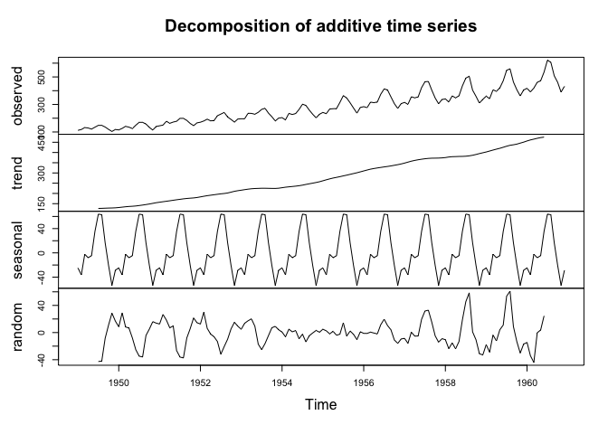

# Week 12

### Last Week’s Recap

- fitting GP models
- Spatial predictions
- Variograms

### This week

- Spatial EDA
- GP models to spatial data
- Spatial Prediction / Model Choice

------------------------------------------------------------------------

# Exploratory Data Analysis

## EDA Overview

- Exploratory Data Analysis (EDA) is commonly used to explore and
  visualize data sets.
- EDA is not a formal analysis, but can inform modeling decisions.
- What are we interested in learning about with spatial data?

## Data Decomposition: Time Series

- In time series analysis, the first step in the EDA process was to
  decompose the observed data into a trend, seasonal cycles, and a
  random component.

## Data Decomposition: Spatial Data

- Similarly spatial data will be decomposed into the mean surface and
  the error surface.

- For example, elevation and distance from major bodies of water would
  be part of the mean surface for temperature.

- The mean surface is focused on the global, or first-order, behavior.

- The error surface captures local fluctuations, or second-order,
  behavior.

- Spatial structure in the response surface and spatial structure in the
  error surface are not one-and-the-same.

- Data sets contain two general types of useful information: spatial
  coordinates and covariates.

- Regression models will be used to build the mean surface.

## Spatial EDA Overview

1.  Map of locations
2.  Histogram or other distributional figures
3.  3D scatterplot
4.  General Regression EDA
5.  Variograms and variogram clouds
6.  Anistopic diagnostics

Then model fitting & diagnostics follow…

# Scallops Data Example

Consider the `scallop` dataset collected in 1990 of the coast of Long
Island.

## 1. Map of Locations

## 2. Histogram (distribution of response)

## 3. 3D scatterplot

Create a sampling map that shows the response using color and/or size

## 4. General Regression EDA

- Assessing relationship between variable of interest and covariate
  information
- No covariates are present in the scallops data
- In some cases latitude and longitude can be used as covariates

## 5. Variograms

## 6. Anisotropy

The variogram function has an argument `alpha` that specifies the angle
between the points. Use this `alpha = c(0, 45, 90, 135)` to create a
directional variogram.

------------------------------------------------------------------------

## Model fitting

There are several paradigms for model selection. Here we will motivate
using a test & training set to compare predictions from a spatial and
non-spatial model.

On the test set, compare root mean squared error (RMSE) (square root of
$\sum_i(y_i - y_{i,pred})^2 / n$) and mean absolute deviation (MAD)
$\sum_i|y_i - y_{i,pred}| / n$

#### 1. Create a test and training set from the scallop dataset. Then create a visual to show the test / training datasets.

I’d recommend using ~100 to fit your model (training set) and ~50 for
prediction (test set).

#### 2. Write code to estimate a non-spatial model using just the mean structure. Then construct a figure that includes mean predictions for each site in the test dataset.

**Write out the model that corresponds to the stan code below.**

    data {
      int<lower=0> N; // number of observed data points 
      vector[N] y; // observed response
      int<lower=0> N_preds; // number of predictive points
    }

    parameters {
      real<lower = 0> tausq;
      real mu;
    }

    transformed parameters{
      vector[N] mu_vec;
      vector[N] tausq_vec;
      for(i in 1:N) mu_vec[i] = mu;
      for(i in 1:N) tausq_vec[i] = tausq;
    }

    model {
      y ~ multi_normal(mu_vec ,diag_matrix(tausq_vec));
      mu ~ normal(0, 10);
      
    }

    generated quantities {
      vector[N_preds] y_preds;
      vector[N_preds] mu_preds;
      vector[N_preds] tausq_preds;

      for(i in 1:N_preds) mu_preds[i] = mu;
      for(i in 1:N_preds) tausq_preds[i] = tausq;

      y_preds = multi_normal_rng(mu_preds, diag_matrix(tausq_preds));
    }

#### 3. Now fit a model with spatial structure and construct a figure that includes mean predictions for each site in the test dataset.

    data {
      int<lower=0> N; // number of observed data points 
      vector[N] y; // observed response
      matrix[N,N] dist; // observed distance matrix
      real phi_lower; // lower point for phi (range)
      real phi_upper; // upper point for phi (range)
      int<lower=0> N_preds; // number of predictive points
      matrix[N_preds,N_preds] dist_preds; // distance matrix for predictive points
      matrix[N, N_preds] dist_12; //distance between observed and predicted
      real phi_a;
      real phi_b;
      real sigmasq_a;
      real sigmasq_b;
      real tausq_a;
      real tausq_b;
    }

    parameters {
      real<lower = phi_lower, upper = phi_upper> phi;
      real<lower = 0> sigmasq;
      real<lower = 0> tausq;
      real mu;
    }

    transformed parameters{
      vector[N] mu_vec;
      vector[N] tausq_vec;
      corr_matrix[N] Sigma;
      
      for(i in 1:N) mu_vec[i] = mu;
      for(i in 1:(N-1)){
       for(j in (i+1):N){
         Sigma[i,j] = exp((-1)*dist[i,j]/ phi);
         Sigma[j,i] = Sigma[i,j];
       }
     }
     for(i in 1:N) Sigma[i,i] = 1;
     for(i in 1:N) tausq_vec[i] = tausq;
    }

    model {
      matrix[N, N] L;
      L = cholesky_decompose(sigmasq * Sigma + diag_matrix(tausq_vec));

      y ~ multi_normal_cholesky(mu_vec, L);
      phi ~ inv_gamma(phi_a, phi_b);
      sigmasq ~ inv_gamma(sigmasq_a, sigmasq_b);
      tausq ~ inv_gamma(tausq_a, tausq_b);
      mu ~ normal(0, 10);
    }

    generated quantities {
      vector[N_preds] y_preds;
      vector[N] y_diff;
      vector[N_preds] mu_preds;
      corr_matrix[N_preds] Sigma_preds;
      vector[N_preds] tausq_preds;
      matrix[N, N_preds] Sigma_12;

      for(i in 1:N_preds) tausq_preds[i] = tausq;
      for(i in 1:N_preds) mu_preds[i] = mu;
      for(i in 1:N) y_diff[i] = y[i] - mu;
      

      for(i in 1:(N_preds-1)){
       for(j in (i+1):N_preds){
         Sigma_preds[i,j] = exp((-1)*dist_preds[i,j]/ phi);
         Sigma_preds[j,i] = Sigma_preds[i,j];
       }
     }
     for(i in 1:N_preds) Sigma_preds[i,i] = 1;
     
       for(i in 1:(N)){
       for(j in (1):N_preds){
         Sigma_12[i,j] = exp((-1)*dist_12[i,j]/ phi);
       }
     }

    y_preds = multi_normal_rng(mu_preds + (sigmasq * Sigma_12)' * inverse(sigmasq * Sigma) * (y_diff), sigmasq * Sigma_preds + diag_matrix(tausq_preds) - (sigmasq * Sigma_12)' * inverse(sigmasq * Sigma + diag_matrix(tausq_vec)) * (sigmasq * Sigma_12) );
    }

**What is the statistical model implied by this stan code?**

**Discuss the parameter fits from this code.**

#### 4. Compare the predictive ability of the spatial and non-spatial model using RMSE and MAD
