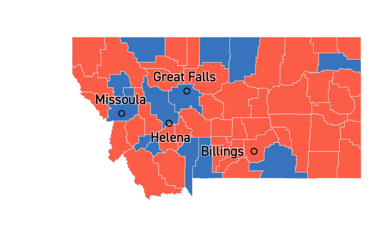
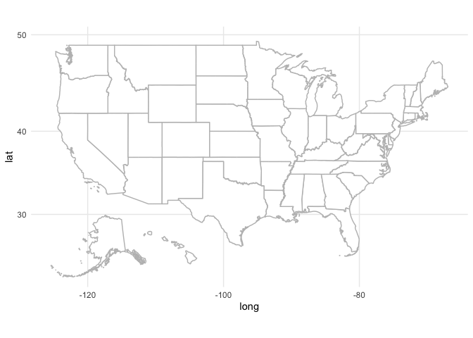
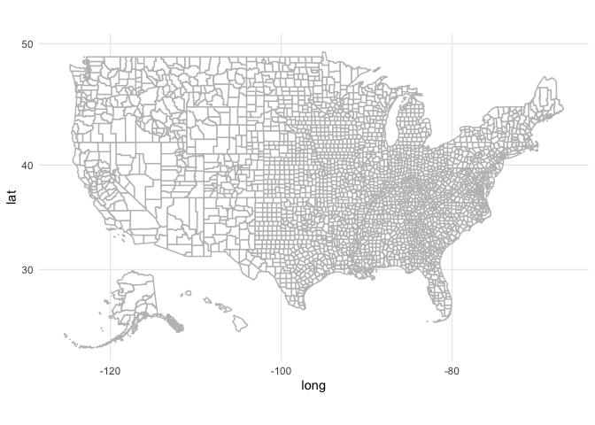
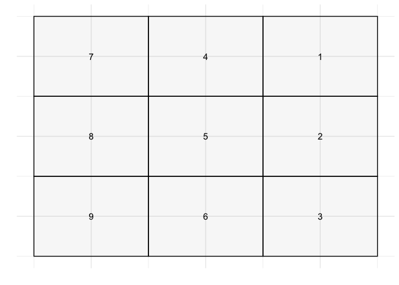
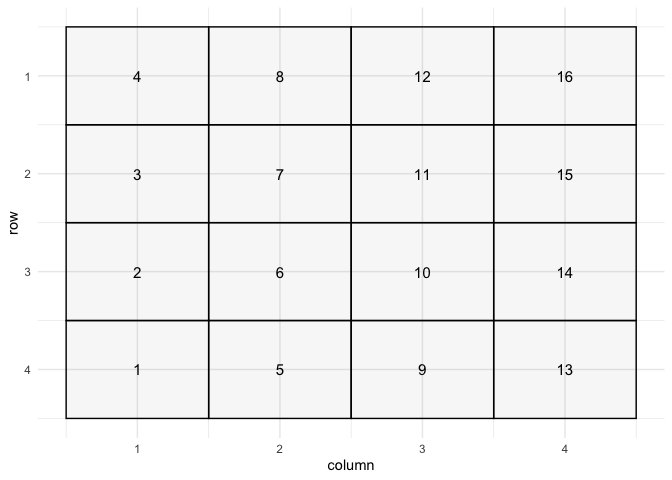

# Week 15: Activity


### This Week

- Intro to Areal Data
- Areal Data Visualization
- Assessing Spatial Structure in Areal Data

------------------------------------------------------------------------



Do you think this figure shows spatial structure?

If so, how can spatial information be incorporated with this data type?

## Areal Data Intro

Defining features: random observation measured at well defined subsets,
such as a city or state. Data, typically averages or totals, are
captured for geographic units or blocks

One way to characterize the transition from geostatistical, or
point-referenced, data to areal data is that of going from a continuous
spatial process to a discrete spatial process.

Another way to characterize the transition from point pattern data to
areal data is thinking of areal data as taking the count of point
pattern observations in each areal unit.

Spatial correlation is incorporated with

Autoregressive models on

Model based approaches will incorporate covariates and introduce spatial
structure with random effects.

#### Areal Data Inferential Questions

Is there a spatial pattern?

In presenting a map of expected responses, should the raw values or a
smoothed response be presented?

What values would be expected for new set of areal units?

## Areal Data Visualization

#### Choropleth Tutorial

``` r
#devtools::install_github("UrbanInstitute/urbnmapr")

library(urbnmapr)
```

What are the objects `urbnmapr::states` and `urbnmapr::counties`?

    # A tibble: 83,933 × 9
        long   lat order hole  piece group state_fips state_abbv state_name
       <dbl> <dbl> <int> <lgl> <fct> <fct> <chr>      <chr>      <chr>     
     1 -88.5  31.9     1 FALSE 1     01.1  01         AL         Alabama   
     2 -88.5  31.9     2 FALSE 1     01.1  01         AL         Alabama   
     3 -88.5  31.9     3 FALSE 1     01.1  01         AL         Alabama   
     4 -88.5  32.0     4 FALSE 1     01.1  01         AL         Alabama   
     5 -88.5  32.0     5 FALSE 1     01.1  01         AL         Alabama   
     6 -88.5  32.1     6 FALSE 1     01.1  01         AL         Alabama   
     7 -88.4  32.2     7 FALSE 1     01.1  01         AL         Alabama   
     8 -88.4  32.2     8 FALSE 1     01.1  01         AL         Alabama   
     9 -88.4  32.2     9 FALSE 1     01.1  01         AL         Alabama   
    10 -88.4  32.3    10 FALSE 1     01.1  01         AL         Alabama   
    # ℹ 83,923 more rows

    # A tibble: 208,874 × 12
        long   lat order hole  piece group   county_fips state_abbv state_fips
       <dbl> <dbl> <int> <lgl> <fct> <fct>   <chr>       <chr>      <chr>     
     1 -86.9  32.7     1 FALSE 1     01001.1 01001       AL         01        
     2 -86.8  32.7     2 FALSE 1     01001.1 01001       AL         01        
     3 -86.7  32.7     3 FALSE 1     01001.1 01001       AL         01        
     4 -86.7  32.7     4 FALSE 1     01001.1 01001       AL         01        
     5 -86.4  32.7     5 FALSE 1     01001.1 01001       AL         01        
     6 -86.4  32.4     6 FALSE 1     01001.1 01001       AL         01        
     7 -86.4  32.4     7 FALSE 1     01001.1 01001       AL         01        
     8 -86.5  32.4     8 FALSE 1     01001.1 01001       AL         01        
     9 -86.5  32.4     9 FALSE 1     01001.1 01001       AL         01        
    10 -86.5  32.4    10 FALSE 1     01001.1 01001       AL         01        
    # ℹ 208,864 more rows
    # ℹ 3 more variables: county_name <chr>, fips_class <chr>, state_name <chr>





What is `urbnmapr::countydata`? Create a choropleth using this dataset
to visualize median household income both nationally and in Montana.

    # A tibble: 3,142 × 5
        year county_fips  hhpop horate medhhincome
       <int> <chr>        <dbl>  <dbl>       <int>
     1  2015 01001       20237.  0.746       52200
     2  2015 01003       72269   0.733       53600
     3  2015 01005       10287.  0.587       32400
     4  2015 01007        8198.  0.687       26000
     5  2015 01009       21094.  0.832       53000
     6  2015 01011        4104.  0.587       32400
     7  2015 01013        7859.  0.686       37900
     8  2015 01015       44323   0.696       42880
     9  2015 01017       12987.  0.728       37300
    10  2015 01019       10181.  0.713       37800
    # ℹ 3,132 more rows

## Assessing Spatial Structure in Areal Data

#### Proximity Matrix

Similar to the distance matrix with point-reference data, a proximity
matrix $W$ is used to model areal data.

Given measurements $Y_i, \dots, Y_n$ associated with areal units
$1, \dots, n$, the elements of $W$, $w_{ij}$ connect units $i$ and $j$

Common values for $w_{ij}$ are $w_{ij} = 1$ if i and j are adjacent and
$w_{ij}=0$ otherwise

#### Grid Example



Create an adjacency matrix with diagonal neighbors

Create an adjacency matrix without diagonal neighbors

## Spatial Association

There are two common statistics used for assessing spatial association:
Moran’s I and Geary’s C.

Moran’s I
$I =n \sum_i \sum_j w_{ij} (Y_i - \bar{Y})(Y_j -\bar{Y}) / (\sum_{i\neq j \;w_{ij}})\sum_i(Y_i - \bar{Y})^2$

Moran’s I is analogous to correlation, where values close to 1 exhibit
spatial clustering and values near -1 show spatial regularity
(checkerboard effect).

Geary’s C
$C=(n-1)\sum_i \sum_j w_{ij}(Y_i-Y_j)^2 / 2(\sum_{i \neq j \; w_{ij}})\sum_i (Y_i - \bar{Y})^2$

Geary’s C is more similar to a variogram (has a connection to
Durbin-Watson in 1-D). The statistics ranges from 0 to 2; values close
to 2 exhibit regularity and values close to 1 show clustering.

## Spatial Association Exercise

Consider the following scenarios and use the following 4-by-4 grid



and proximity matrix

         [,1] [,2] [,3] [,4] [,5] [,6] [,7] [,8] [,9] [,10] [,11] [,12] [,13] [,14]
    [1,]    0    1    0    0    1    0    0    0    0     0     0     0     0     0
    [2,]    1    0    1    0    0    1    0    0    0     0     0     0     0     0
    [3,]    0    1    0    1    0    0    1    0    0     0     0     0     0     0
    [4,]    0    0    1    0    0    0    0    1    0     0     0     0     0     0
    [5,]    1    0    0    0    0    1    0    0    1     0     0     0     0     0
    [6,]    0    1    0    0    1    0    1    0    0     1     0     0     0     0
         [,15] [,16]
    [1,]     0     0
    [2,]     0     0
    [3,]     0     0
    [4,]     0     0
    [5,]     0     0
    [6,]     0     0

for each scenario plot the grid, calculate I and G, along with
permutation-based p-values. Note you can use `moran.test()` and
`geary.test()` from `spdep`



1.  Simulate data where the responses are i.i.d. N(0,1).



2.  Simulate data and calculate I and G for a 4-by-4 grid with a chess
    board approach, where “black squares” $\sim N(-2,1)$ and “white
    squares” $\sim N(2,1)$.



3.  Simulate multivariate normal response on a 4-by-4 grid where
    $y \sim N(0, (I- \rho W)^{-1})$, where $\rho = .3$ is a correlation
    parameter and $W$ is a proximity matrix.
