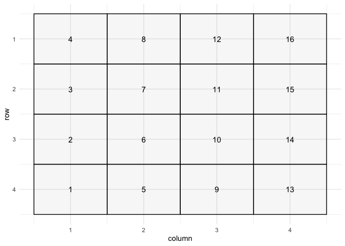
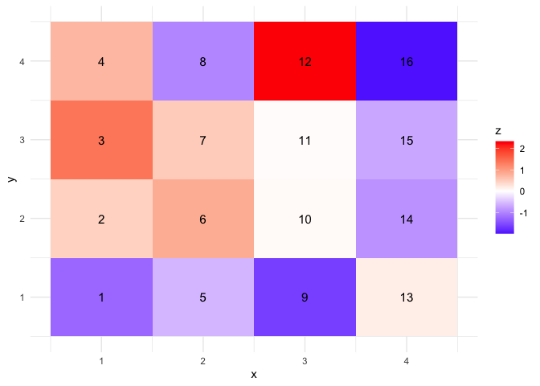
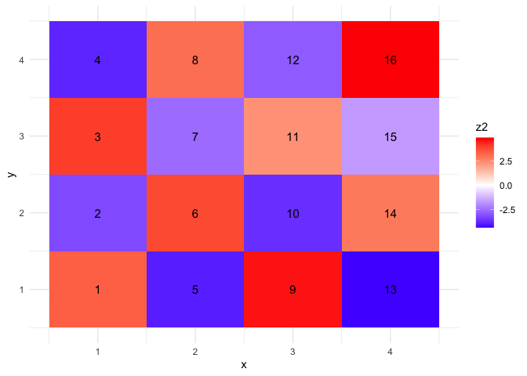
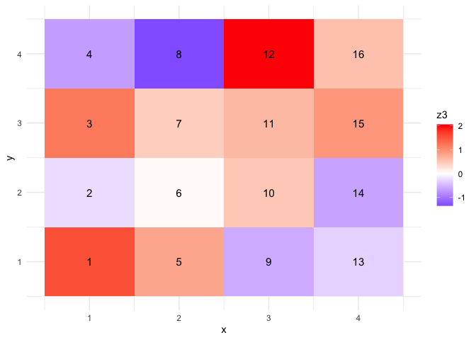
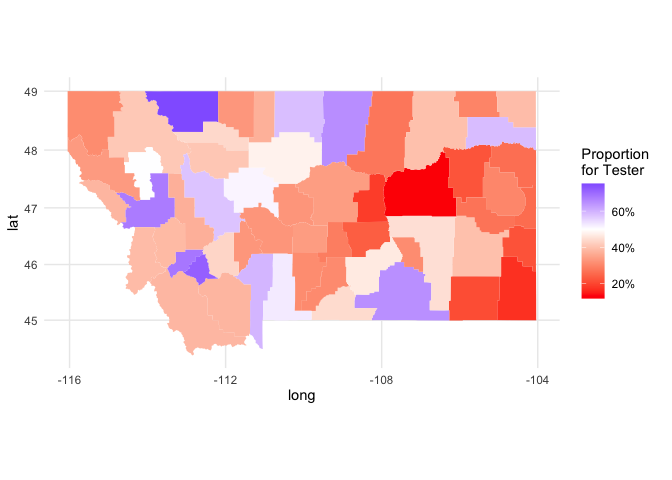
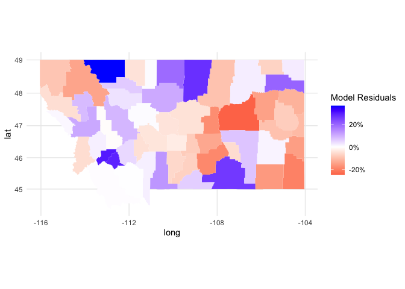

# Week 15: Activity Key

### Last Time

- Intro to Areal Data
- Areal Data Visualization
- Assessing Spatial Structure in Areal Data

### This Time

- Assessing Spatial Structure in Areal Data
- Spatial Smoothing with Areal Data

------------------------------------------------------------------------

## Spatial Association

There are two common statistics used for assessing spatial association:
Moran’s I and Geary’s C.

Moran’s I
$I =n \sum_i \sum_j w_{ij} (Y_i - \bar{Y})(Y_j -\bar{Y}) / (\sum_{i\neq j \;w_{ij}})\sum_i(Y_i - \bar{Y})^2$

Moran’s I is analogous to correlation, where values close to 1 exhibit
spatial clustering and values near -1 show spatial regularity
(checkerboard effect).

Geary’s C
$C=(n-1)\sum_i \sum_j w_{ij}(Y_i-Y_j)^2 / 2(\sum_{i \neq j \; w_{ij}})\sum_i (Y_i - \bar{Y})^2$

Geary’s C is more similar to a variogram (has a connection to
Durbin-Watson in 1-D). The statistics ranges from 0 to 2; values close
to 2 exhibit clustering and values close to 0 show repulsion. A Geary’s
C near 1 would be expected with no spatial structure.

## Spatial Association Exercise

Consider the following scenarios and use the following 4-by-4 grid



and proximity matrix

         [,1] [,2] [,3] [,4] [,5] [,6] [,7] [,8] [,9] [,10] [,11] [,12] [,13] [,14]
    [1,]    0    1    0    0    1    0    0    0    0     0     0     0     0     0
    [2,]    1    0    1    0    0    1    0    0    0     0     0     0     0     0
    [3,]    0    1    0    1    0    0    1    0    0     0     0     0     0     0
    [4,]    0    0    1    0    0    0    0    1    0     0     0     0     0     0
    [5,]    1    0    0    0    0    1    0    0    1     0     0     0     0     0
    [6,]    0    1    0    0    1    0    1    0    0     1     0     0     0     0
         [,15] [,16]
    [1,]     0     0
    [2,]     0     0
    [3,]     0     0
    [4,]     0     0
    [5,]     0     0
    [6,]     0     0

for each scenario plot the grid, calculate I and G, along with
permutation-based p-values.

1.  Simulate data where the responses are i.i.d. N(0,1).

``` r
d4$z <- rnorm(16)

ggplot() + 
  geom_tile(data=d4, mapping=aes(x = x, y = y, fill = z)) +
  geom_text(data=d4, aes(x=xmin+(xmax-xmin)/2, y=ymin+(ymax-ymin)/2, label=id), size=4) +
  theme_minimal() + scale_fill_gradient2(midpoint=0, low="blue", mid="white",
                     high="red", space ="Lab" )
```



``` r
moran.test(d4$z, mat2listw(W), alternative = 'two.sided')
```


        Moran I test under randomisation

    data:  d4$z  
    weights: mat2listw(W)    

    Moran I statistic standard deviate = -0.12963, p-value = 0.8969
    alternative hypothesis: two.sided
    sample estimates:
    Moran I statistic       Expectation          Variance 
          -0.09014401       -0.06666667        0.03279918 

``` r
#moran.plot(d4$z, mat2listw(W))
geary.test(d4$z, mat2listw(W), alternative = 'two.sided')
```


        Geary C test under randomisation

    data:  d4$z 
    weights: mat2listw(W)   

    Geary C statistic standard deviate = 0.25159, p-value = 0.8014
    alternative hypothesis: two.sided
    sample estimates:
    Geary C statistic       Expectation          Variance 
           0.95265709        1.00000000        0.03540838 

2.  Simulate data and calculate I and G for a 4-by-4 grid with a chess
    board approach, where “black squares” $\sim N(-2,1)$ and “white
    squares” $\sim N(2,1)$.

``` r
d4$z2 <- 0

for (i in 1:16){
  if ((d4$rpos[i] + d4$cpos[i])%% 2 == 1) {
    d4$z2[i] <- rnorm(1, mean = 3)
  } else {
    d4$z2[i] <- rnorm(1, mean = -3)
  }
}

ggplot() + 
  geom_tile(data=d4, mapping=aes(x = x, y = y, fill = z2)) +
  geom_text(data=d4, aes(x=xmin+(xmax-xmin)/2, y=ymin+(ymax-ymin)/2, label=id), size=4) +
  theme_minimal() + scale_fill_gradient2(midpoint=0, low="blue", mid="white",
                     high="red", space ="Lab" )
```



``` r
moran.test(d4$z2, mat2listw(W), alternative = 'two.sided')
```


        Moran I test under randomisation

    data:  d4$z2  
    weights: mat2listw(W)    

    Moran I statistic standard deviate = -4.3983, p-value = 1.091e-05
    alternative hypothesis: two.sided
    sample estimates:
    Moran I statistic       Expectation          Variance 
          -0.90821487       -0.06666667        0.03660921 

``` r
geary.test(d4$z2, mat2listw(W), alternative = 'two.sided')
```


        Geary C test under randomisation

    data:  d4$z2 
    weights: mat2listw(W)   

    Geary C statistic standard deviate = -4.093, p-value = 4.258e-05
    alternative hypothesis: two.sided
    sample estimates:
    Geary C statistic       Expectation          Variance 
           1.74348378        1.00000000        0.03299537 

3.  Simulate multivariate normal response on a 4-by-4 grid where
    $y \sim N(0, (I- \rho W)^{-1})$, where $\rho = .3$ is a correlation
    parameter and $W$ is a proximity matrix.




        Moran I test under randomisation

    data:  d4$z3  
    weights: mat2listw(W)    

    Moran I statistic standard deviate = -0.10646, p-value = 0.9152
    alternative hypothesis: two.sided
    sample estimates:
    Moran I statistic       Expectation          Variance 
          -0.08611045       -0.06666667        0.03335911 


        Geary C test under randomisation

    data:  d4$z3 
    weights: mat2listw(W)   

    Geary C statistic standard deviate = 0.27567, p-value = 0.7828
    alternative hypothesis: two.sided
    sample estimates:
    Geary C statistic       Expectation          Variance 
           0.94838712        1.00000000        0.03505375 

## Spatial Smoothing

Spatial smoothing results in a “smoother” spatial surface, by sharing
information from across the neighborhood structure.

This smoothing is akin to fitted values (expected values) in a
traditional modeling framework.

One option is replacing $Y_i$ with

$$\hat{Y}_i = \sum_j w_{ij} Y_j / w_{i+}$$ where
$w_{i+} = \sum_j w_{ij}$.

What are some pros and cons of this smoother?

### “Exponential” smoother

Another option would be to use:
$$\hat{Y}_i^* = (1 - \alpha) Y_i + \hat{Y}_i$$

Compare $\hat{Y}_i^*$ with $\hat{Y}_i$.

What is the impact of $\alpha?$ *This is essentially the exponential
smoother from time series.*

Recall the motivating image,


using the following dataset

recreate the image. Recall `urbnmapr::counties` has a shape file with
county level boundaries.



recreate the image.

## Adjacency Matrix

Follow the code below to create an adjacency matrix for Montana.

``` r
MT_sf <- get_urbn_map("counties", sf = TRUE) |>
  filter(state_abbv == 'MT') |>
  arrange(county_fips)

# MT.Counties <- urbnmapr::counties |> 
#   filter(state_abbv == 'MT') 

#sf_MT <- st_as_sf(MT_sf)

mt_W <- nb2mat(poly2nb(MT_sf), style = 'B')
MT_list <- nb2listw(poly2nb(MT_sf), style = 'B')
```

## Moran’s I / Geary’s C

Using the Tester - Rosendale election results and the adjacency matrix
compute and interpret Moran’s I and Geary’s C with the proportion voting
for Tester.

``` r
#Tester <- Tester %>% mutate(COUNTY = tolower(COUNTY))
#Tester$COUNTY[Tester$COUNTY == 'lewis & clark'] <- 'lewis and clark'

comb <- tibble(FIPS = MT_sf$county_fips)  |>
  left_join(Tester |> mutate(FIPS = as.character(FIPS)), by = "FIPS")

moran.test(comb$Tester_Prop[1:56], MT_list, alternative = 'two.sided')
```


        Moran I test under randomisation

    data:  comb$Tester_Prop[1:56]  
    weights: MT_list    

    Moran I statistic standard deviate = 2.4677, p-value = 0.0136
    alternative hypothesis: two.sided
    sample estimates:
    Moran I statistic       Expectation          Variance 
          0.180358974      -0.018181818       0.006473302 

``` r
geary.test(comb$Tester_Prop[1:56], MT_list, alternative = 'two.sided')
```


        Geary C test under randomisation

    data:  comb$Tester_Prop[1:56] 
    weights: MT_list   

    Geary C statistic standard deviate = 2.1829, p-value = 0.02905
    alternative hypothesis: two.sided
    sample estimates:
    Geary C statistic       Expectation          Variance 
          0.782705873       1.000000000       0.009909346 

## Now consider some covariates to explain the response

Consider a linear model with county population

``` r
library(usmap)
usmap::countypop
```

    # A tibble: 3,222 × 4
       fips  abbr  county          pop_2022
       <chr> <chr> <chr>              <dbl>
     1 01001 AL    Autauga County     59759
     2 01003 AL    Baldwin County    246435
     3 01005 AL    Barbour County     24706
     4 01007 AL    Bibb County        22005
     5 01009 AL    Blount County      59512
     6 01011 AL    Bullock County     10202
     7 01013 AL    Butler County      18650
     8 01015 AL    Calhoun County    115788
     9 01017 AL    Chambers County    34088
    10 01019 AL    Cherokee County    25302
    # ℹ 3,212 more rows


    Call:
    lm(formula = Tester_Prop ~ scale_pop, data = lm_dat)

    Residuals:
         Min       1Q   Median       3Q      Max 
    -0.24689 -0.08132 -0.01662  0.06041  0.36461 

    Coefficients:
                Estimate Std. Error t value Pr(>|t|)    
    (Intercept)  0.39758    0.01794  22.165  < 2e-16 ***
    scale_pop    0.06035    0.01810   3.334  0.00155 ** 
    ---
    Signif. codes:  0 '***' 0.001 '**' 0.01 '*' 0.05 '.' 0.1 ' ' 1

    Residual standard error: 0.1342 on 54 degrees of freedom
    Multiple R-squared:  0.1707,    Adjusted R-squared:  0.1554 
    F-statistic: 11.12 on 1 and 54 DF,  p-value: 0.001551

Extract the residuals create a choropleth and test for spatial
structure.




        Moran I test under randomisation

    data:  comb$resids  
    weights: MT_list    

    Moran I statistic standard deviate = 1.8839, p-value = 0.05958
    alternative hypothesis: two.sided
    sample estimates:
    Moran I statistic       Expectation          Variance 
          0.132471591      -0.018181818       0.006395106 


        Geary C test under randomisation

    data:  comb$resids 
    weights: MT_list   

    Geary C statistic standard deviate = 1.687, p-value = 0.09161
    alternative hypothesis: two.sided
    sample estimates:
    Geary C statistic       Expectation          Variance 
           0.82204115        1.00000000        0.01112843 

### Areal Data Models: Disease Mapping

Areal data with counts is often associated with disease mapping, where
there are two quantities for each areal unit: $Y_i =$ observed number of
cases of disease in county i and $E_i =$ expected number of cases of
disease in county i.

Note this can also be used to model generic count data on area units.

One way to think about the expected counts is
$$E_i = n_i \bar{r} = n_i \left(\sum_j y_j / \sum_j n_j  \right),$$
where $\bar{r}$ is the overall disease rate and $n_i$ is the population
for region $i$.

However note that $\bar{r},$ and hence, $E_i$ is a not fixed, but is a
function of the data. This is called *internal standardization*.

An alternative is to use some standard rate for a given age group, such
that $E_i = \sum_j n_{ij} r_j.$ This is *external standardization.*

Often counts are assumed to follow the Poisson model where
$$Y_i|\eta_i \sim Poisson(E_i \eta_i),$$ where $\eta_i$ is the relative
risk of the disease in region $i$. This quantity is known as the
*standardized morbidity ratio* (SMR).

Then the MLE of $\eta_i$ is $Y_i /E_i$.

<!-- #### Poisson-Gamma Model -->
<!-- Consider the following framework -->
<!-- $Y_i | \eta_i \sim Pois(E_i \eta_i)$ and $\eta_i \sim Gamma(a,b)$ -->
<!-- where the gamma distribution has mean $a/b$ and variance is $a/b^2$. -->
<!-- \vfill -->
<!-- This can be reparameterized such that $a = \mu^2 / \sigma^2$ and $b = \mu /\sigma^2$. -->
<!-- \vfill -->
<!-- For the Poisson sampling model, the gamma prior is conjugate. This means that the posterior distribution $p(\eta_i | y_i)$ is also a gamma distribution, and in particular, the posterior distribution $p(\eta_i|y_i)$ is $Gamma(y_i + a, E_i + b)$. -->
<!-- \vfill -->
<!-- The mean of this distribution is -->
<!-- \begin{eqnarray*} -->
<!-- E(\eta_i | \boldsymbol{y}) = E(\eta_i| y_i) &=& \frac{y_i + a}{E_i + b} = \frac{y_i + \frac{\mu^2}{\sigma^2}}{E_i + \frac{\mu}{\sigma^2}}\\ -->
<!-- &=& \frac{E_i (\frac{y_i}{E_i})}{E_i + \frac{\mu}{\sigma^2}} + \frac{(\frac{\mu}{\sigma^2})\mu}{E_i + \frac{\mu}{\sigma2}}\\ -->
<!-- &=& w_i SMR_i + (1 - w_i) \mu, -->
<!-- \end{eqnarray*} -->
<!-- where $w_i = \frac{E_i}{E_i + (\mu / \sigma^2)}$ -->
<!-- \vfill -->
<!-- Thus the point estimate is a weighted average of the data-based SMR for region $i$ and the prior mean $\mu$. -->
<!-- #### Poisson-lognormal models -->
<!-- The model can be written as  -->
<!-- \begin{eqnarray*} -->
<!-- Y_i | \psi_i &\sim& Poisson(E_i \exp(\psi_i))\\ -->
<!-- \psi_i &=& \boldsymbol{x_i^T}\boldsymbol{\beta} + \theta_i + \phi_i -->
<!-- \end{eqnarray*} -->
<!-- where $\boldsymbol{x_i}$ are spatial covariates, $\theta_i$ corresponds to region wide heterogeneity, and $\psi_i$ captures local clustering. -->
<!-- ### Brook's Lemma and Markov Random Fields -->
<!-- To consider areal data from a model-based perspective, it is necessary to obtain the joint distribution of the responses  -->
<!-- $$p(y_1, \dots, y_n).$$ -->
<!-- \vfill -->
<!-- From the joint distribution, the *full conditional distribution* -->
<!-- $$p(y_i|y_j, j \neq i),$$ -->
<!-- is uniquely determined. -->
<!-- \vfill -->
<!-- Brook's Lemma states that the joint distribution can be obtained from the full conditional distributions. -->
<!-- \vfill -->
<!-- When the areal data set is large, working with the full conditional distributions can be preferred to the full joint distribution. -->
<!-- \vfill -->
<!-- More specifically, the response $Y_i$ should only directly depend on the neighbors, hence, -->
<!-- $$p(y_i|y_j, j \neq i) = p(y_i|y_j, j \in \delta_i)$$ -->
<!-- where $\delta_i$ denotes the neighborhood around $i$. -->
<!-- ### Markov Random Field  -->
<!-- The idea of using the local specification for determining the global form of the distribution is Markov random field. -->
<!-- \vfill -->
<!-- An essential element of a MRF is a *clique*, which is a group of units where each unit is a neighbor of all units in the clique -->
<!-- \vfill -->
<!-- A *potential function* is a function that is exchangeable in the arguments. With continuous data a common potential is $(Y_i - Y_j)^2$ if $i \sim j$ ($i$ is a neighbor of $j$). -->
<!-- \vfill -->
<!-- #### Gibbs Distribution -->
<!-- A joint distribution $p(y_1, \dots, y_n)$ is a Gibbs distribution if it is a function of $Y_i$ only through the potential on cliques. -->
<!-- \vfill -->
<!-- Mathematically, this can be expressed as: -->
<!-- $$p(y_1, \dots, y_n) \propto \exp \left(\gamma \sum_k \sum_{\alpha \in \mathcal{M}_k} \phi^{(k)}(y_{\alpha_1},y_{\alpha_2}, \dots, y_{\alpha_k} ) \right),$$ -->
<!-- where $\phi^{(k)}$ is a potential of order $k$, $\mathcal{M}_k$ is the collection of all subsets of size $k = {1, 2, ...}$(typically restricted to 2 in spatial settings), $\alpha$ indexes the set in $\mathcal{M}_k$. -->
<!-- \vfill -->
<!-- \newpage -->
<!-- ### Hammersley-Clifford Theorem -->
<!-- The Hammersley-Clifford Theorem demonstrates that if we have a MRF that defines a unique joint distribution, then that joint distribution is a Gibbs distribution. -->
<!-- \vfill -->
<!-- The converse was later proved, showing that a MRF could be sampled from the associated Gibbs distribution (origination of Gibbs sampler). -->
<!-- \vfill -->
<!-- ### Model Specification -->
<!-- With continuous data, a common choice for the joint distribution is the pairwise difference -->
<!-- $$p(y_1, \dots, y_n) \propto \exp \left(-\frac{1}{2\tau^2} \sum_{i,j}(y_i - y_j)^2 I(i \sim j) \right)$$ -->
<!-- \vfill -->
<!-- Then the full conditional distributions can be written as -->
<!-- $$p(y_i|y_j, j \neq i) = N \left(\sum_{j \in \delta_i} y_i / m_i, \tau^2 / m_i \right)$$ -->
<!-- where $m_i$ are the number of neighbors for unit $i$. -->
<!-- \vfill -->
<!-- This results in a spatial smoother, where the mean of a response is the average of the neighbors. -->
<!-- ## Conditional Autoregressive Models -->
<!-- ## Gaussian Model -->
<!-- Suppose the full conditionals are specifed as -->
<!-- $$Y_i|y_j, j\neq i \sim N \left(\sum_j b_{ij} y_j, \tau_i^2 \right)$$ -->
<!-- \vfill -->
<!-- Then using Brooks' Lemma, the joint distribution is -->
<!-- $$p(y_1, \dots, y_n) \propto \exp \left(-\frac{1}{2}\boldsymbol{y}^T D^{-1} (I - B) \boldsymbol{y} \right),$$ -->
<!-- where $B$ is a matrix with entries $b_{ij}$ and D is a diagonal matrix with diagonal elements $D_{ii} = \tau_i^2$. -->
<!-- \vfill -->
<!-- The previous equation suggests a multivariate normal distribution, but $D^{-1}(I - B)$ should be symmetric. -->
<!-- \vfill -->
<!-- Symmetry requires $$\frac{b_{ij}}{\tau^2_i}=\frac{b_{ji}}{\tau^2_j}, \; \; \forall \; \; i , j$$ -->
<!-- \vfill -->
<!-- In general, $B$ is not symmetric, but setting $b_{ij} = w_{ij}/ w_{i+}$ and $\tau_i^2 = \tau^2 / w_{i+}$ satisfies the symmetry assumptions (given that we assume W is symmetric) -->
<!-- \vfill -->
<!-- \newpage -->
<!-- Now the full conditional distribution can be written as -->
<!-- $$Y_i|y_j, j\neq i \sim N \left(\sum_j w_{ij} y_j / w_{i+}, \tau^2 / w_{i+} \right)$$ -->
<!-- \vfill -->
<!-- Similarly the joint distribution is now -->
<!-- $$p(y_1, \dots, y_n) \propto \exp \left(-\frac{1}{2 \tau^2}\boldsymbol{y}^T  (D_w - W) \boldsymbol{y} \right)$$ -->
<!-- where $D_w$ is a diagonal matrix with diagonal entries $(D_w)_{ii} = w_{i+}$  -->
<!-- \vfill -->
<!-- The joint distribution can also be re-written as -->
<!-- $$p(y_1, \dots, y_n) \propto \exp \left(-\frac{1}{2 \tau^2} \sum_{i \neq j} w_{ij} (y_i - y_j)^2\right)$$ -->
<!-- \vfill -->
<!-- However, both these formulations results in an improper distribution. This could be solved with a constraint, such as $Y_i = 0$. -->
<!-- \vfill -->
<!-- The result is the joint distribution is improper, despite proper full conditional distributions. This model specification is often referred to as an *intrinsically autoregressive* model (IAR). -->
<!-- \vfill -->
<!-- \newpage -->
<!-- ## IAR -->
<!-- The IAR cannot be used to model data directly, rather this is used a prior specification and attached to random effects specified at the second stage of the hierarchical model. -->
<!-- \vfill -->
<!-- The impropriety can be remedied by defining a parameter $\rho$ such that $(D_w - W)$ becomes $(D_w - \rho W)$ such that this matrix is nonsingular. -->
<!-- \vfill -->
<!-- The parameter $\rho$ can be considered an extra parameter in the CAR model. -->
<!-- \vfill -->
<!-- With or without $\rho,$ $p(\boldsymbol{y})$ (or the Bayesian posterior when the CAR specification is placed on the spatial random effects) is proper. -->
<!-- \vfill -->
<!-- When using $\rho$, the full conditional becomes $$Y_i|y_j, j\neq i \sim N \left(\rho \sum_j w_{ij} y_j / w_{i+}, \tau^2 / w_{i+} \right)$$ -->
<!-- \vfill -->
<!-- ## Simultaneous Autoregression Model -->
<!-- Rather than specifying the distribution on $\boldsymbol{Y}$, as in the CAR specification, the distribution can be specified for $\boldsymbol{\epsilon}$ which induces a distribution for $\boldsymbol{Y}$. -->
<!-- \vfill -->
<!-- Let $\boldsymbol{\epsilon} \sim N(\boldsymbol{0}, \tilde{D})$, where $\tilde{D}$ is a diagonal matrix with elements $(\tilde{D})_{ii} = \sigma^2_i$. -->
<!-- \vfill -->
<!-- Now $Y_i = \sum_j b_{ij} Y_j + \epsilon_i$ or equivalently $(I-B)\boldsymbol{Y} = \boldsymbol{\epsilon}$. -->
<!-- \vfill -->
<!-- \newpage -->
<!-- ## SAR Model -->
<!-- If the matrix $(I - B)$ is full rank, then  -->
<!-- $$\boldsymbol{Y} \sim N \left(\boldsymbol{0},(I - B)^{-1} \tilde{D} ((I - B)^{-1})^T \right)$$ -->
<!-- \vfill -->
<!-- If $\tilde{D} = \sigma^2 I$, then $\boldsymbol{Y} \sim N \left(\boldsymbol{0},\sigma^2 \left[(I - B)  (I - B)^T \right]^{-1} \right)$ -->
<!-- \vfill -->
<!-- #### Choosing B -->
<!-- There are two common approaches for choosing B -->
<!-- \vfill -->
<!-- 1. $B = \rho W,$ where $W$ is a contiguity matrix with entries 1 and 0. The parameter $\rho$ is called the spatial autoregression parameter. -->
<!-- \vfill -->
<!-- 2. $B = \alpha \tilde{W}$ where $(\tilde{W})_{ij} = w_{ij} / w_{i+}.$ The $\alpha$ parameter is called the spatial autocorrelation parameter. -->
<!-- \vfill -->
<!-- SAR Models are often introduced in a regression context, where the residuals $(\boldsymbol{U})$ follow a SAR model. -->
<!-- \vfill -->
<!-- Let $\boldsymbol{U} = \boldsymbol{Y} - X \boldsymbol{\beta}$ and then $\boldsymbol{U} = B \boldsymbol{U} + \boldsymbol{\epsilon}$ which results in -->
<!-- $$\boldsymbol{Y} = B \boldsymbol{Y} + (I-B) X \boldsymbol{\beta} + \boldsymbol{\epsilon}$$ -->
<!-- \vfill -->
<!-- Hence the model contains a spatial weighting of neighbors $(B \boldsymbol{Y})$ and a regression component $((I-B) X \boldsymbol{\beta} )$. -->
<!-- \vfill -->
<!-- The SAR specification is not typically used in a GLM setting. -->
<!-- \vfill -->
<!-- SAR models are well suited for maximum likelihood -->
<!-- \vfill -->
<!-- Without specifying a hierarchical form, Bayesian sampling of random effects is more difficult than the CAR specification. -->
