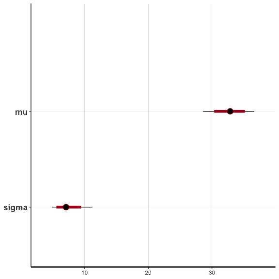

# Week 9: Activity Key


### Last Week’s Recap

- Gaussian Process Intro
- Bayesian inference with `stan`
- Correlation functions

### This week

- GPs in 2D
- Bayesian inference with `stan`

------------------------------------------------------------------------

### Geostatistical Data

At last, we will look at simulated 2-d “spatial” data.

##### 1. Create Sampling Locations

``` r
#set.seed(03062025)

num.locations <- 50
coords <- data.frame(x = runif(num.locations), y = runif(num.locations))
coords %>% ggplot(aes(x=x,y=y)) + geom_point() + 
  ggtitle('Hypothetical Sampling Locations') + xlim(0,1) + 
  ylim(0,1) + theme_bw()
```


##### 2. Calculate Distances

``` r
dist.mat <- sqrt(plgp::distance(coords))
```

##### 3. Define Covariance Function and Set Parameters

Use exponential covariance with no nugget:

``` r
sigma.sq <- 1
phi <- .1
Sigma <- sigma.sq * exp(- dist.mat/phi) + diag(eps, num.locations) 
```

##### 4. Sample realization of the process

- This requires a distributional assumption, we will use the Gaussian
  distribution

``` r
Y <- rmnorm(n=1, mean = 0, varcov = Sigma)
```

- What about the rest of the locations on the map?

##### 5. Vizualize Spatial Process

Start with a coarse grid and them move to a finer grid

``` r
coords %>% mutate(Y = Y) %>% ggplot(aes(x=x,y=y)) + geom_point(aes(color=Y), size=2) + 
  ggtitle(label = 'Simulated Spatial Process', 
          subtitle = 'Exponential Covariance: sigma.sq = 1, phi = .1') +  
  xlim(0,1) + ylim(0,1) +   scale_colour_gradient2() + theme_dark()
```




Now we can look at more sampling locations


How does the spatial process change with:

- another draw with same parameters?
- a different value of $\phi$
- a different value of $\sigma^2$

------------------------------------------------------------------------

### Visual Overview of Bayesian Inference

Using some Bridger Bowl weather data we will provide a visual overview
of Bayesian Inference. *The goal will be to model the average winter
high temperature at the base of Bridger Bowl.*

1.  Prior Specification

- First sketch a prior distribution that encapsulates your belief about
  what you believe the average high temperature would be. *Note this
  should obey law of total probability*

- *Next we generally need to parameterize (perhaps approximately) this
  belief with some sort of probability distribution.*

``` r
temp_seq <- -10:50
prob_seq <- dnorm(temp_seq, mean = 20, sd = 10)
tibble(temp = temp_seq, prob = prob_seq) %>% ggplot(aes(temp, prob)) + geom_line() + theme_bw() +
  ggtitle("Andy's Prior Belief: N(20, 10^2)")
```


*Formally, my prior is on the mean high temp, which we will denote
$\mu$.*

$$\mu \sim N(20, 10^2)$$

2.  Specify the sampling distribution for the data or perhaps in more
    familiar language, state the likelihood for the statistical model

- *We will assume that the temperature readings are continuous (or
  “nearly continuous”)*

- *It seems reasonable to start with a normal distribution, so:*
  $$X|\mu, \sigma^2 \sim N(\mu, \sigma^2)$$

- Note that we also need to estimate $\sigma$ in this model and need a
  prior for that parameter too.

- Grab some weather data from Bridger Bowl (roughly the first half of
  January 2021)

``` r
temp <- c(26, 45, 44, 36, 22, 25, 31, 31, 37, 34, 35, 37, 32, 31)
```

- Any concerns about using this data to inform our research question?

3.  Posterior Inference

- Using classical inference, how would you estimate $\mu$.

- *Using maximum likelihood, $\hat{\mu}_{MLE} = \bar{X}$ = 33.*

- *With Bayesian inference, our posterior belief is based on the data
  **and** our prior belief. Note this can be a blessing or a curse.*

- Formally, we have a distribution for the maximum temperature (a
  posterior distribution):
  $p(\mu|x) = \int p(x|\mu,\sigma) \times p(\mu)p(\sigma) /p(\mu)d\sigma$,
  note solving this is not trivial and isn’t something we will handle in
  this class.

- Luckily, there is an elegant computational procedure that will allow
  us to approximate $p(\mu|x)$ by taking samples from the distribution.
  *This is, of course, MCMC.*

STAN code for this situation can be written as below. Note that the
prior values are hard coded, these could also be passed in as arguments
to the model.

    data {
      int<lower=0> N;
      vector[N] y;
    }


    parameters {
      real mu;
      real<lower=0> sigma;
    }


    model {
      y ~ normal(mu, sigma);
      mu ~ normal(20, 10);
    }

``` r
temp_data <- stan("normal.stan", data=list(N = length(temp), y=temp))
```

``` r
print(temp_data)
```

    Inference for Stan model: anon_model.
    4 chains, each with iter=2000; warmup=1000; thin=1; 
    post-warmup draws per chain=1000, total post-warmup draws=4000.

            mean se_mean   sd   2.5%    25%    50%    75%  97.5% n_eff Rhat
    mu     32.80    0.05 2.00  28.60  31.60  32.86  34.04  36.65  1947    1
    sigma   7.33    0.04 1.62   4.90   6.20   7.07   8.17  11.21  1981    1
    lp__  -32.85    0.03 1.09 -35.76 -33.24 -32.51 -32.08 -31.80  1516    1

    Samples were drawn using NUTS(diag_e) at Thu Mar 13 10:59:44 2025.
    For each parameter, n_eff is a crude measure of effective sample size,
    and Rhat is the potential scale reduction factor on split chains (at 
    convergence, Rhat=1).

``` r
plot(temp_data)
```

    ci_level: 0.8 (80% intervals)

    outer_level: 0.95 (95% intervals)



We can also view the posterior and prior beliefs together on a single
figure.

``` r
tibble(sims = c(extract(temp_data, pars = 'mu')$mu,rnorm(4000, 20, 10)), 
       Distribution = rep(c('posterior','prior'), each = 4000)) %>% 
  ggplot(aes(x = sims, color = Distribution)) + 
  geom_density() + theme_bw() + 
  xlab('Temperature (F)') + ylab('') + 
  ggtitle("Prior and posterior belief for winter temperature in Bozeman")
```


#### Multivariate Normal Distribution

Next we will segue from standard linear models to analyzing correlated
data.

First we will start with the a bivariate normal distribution: y ~
N(theta,sigma), where theta is a mean vector and sigma = sigmasq \* I is
a covariance matrix.

To provide a motivating context, not consider jointly estimating the
temperature at Bridger Bowl *and* Big Sky Resort.

##### 1. Simulate independent bivariate normal

Simulate a set of temperature values from each location, where the
temperature values are independent (sigma = sigmasq \* I)

``` r
library(mnormt)
n <- 100
theta <- c(15,25)
sigma <- diag(2) * 100
fake_temperatures <- rmnorm(n, theta , sigma)
```

Then create a few graphs to show marginal distribution of temperature as
well as how the temperatures evolve in time.

``` r
library(reshape2)
melt(fake_temperatures, value.name = 'temp') %>% 
  rename(location = Var2) %>%
  mutate(location = factor(location)) %>% 
  ggplot(aes(x =temp, fill = location)) + 
  geom_histogram() +
  facet_wrap(.~location) + theme_bw() 
```

    `stat_bin()` using `bins = 30`. Pick better value with `binwidth`.


``` r
melt(fake_temperatures, value.name = 'temp') %>% 
  rename(location = Var2, day = Var1) %>%
  mutate(location = factor(location)) %>%
  ggplot(aes(y =temp, x = day, color = location )) + 
  geom_line() + theme_bw() + xlim(0,30) + 
  ggtitle('First 30 observations of independent response')
```

    Warning: Removed 140 rows containing missing values or values outside the scale range
    (`geom_line()`).


##### 2. Simulate correlated bivariate normal

Simulate a set of temperature values from each location, where the
temperature values are not independent (sigma = sigmasq \* H), where H
is a correlation matrix. (Note there are some constraints we will
discuss later)

``` r
sigma <- matrix(c(1, .9, .9, 1), nrow = 2, ncol = 2) * 100
fake_temperatures_corr <- rmnorm(n, theta , sigma)
```

Then create a few graphs to show marginal distribution of temperature as
well as how the temperatures evolve in time.

``` r
melt(fake_temperatures_corr, value.name = 'temp') %>% 
  rename(location = Var2) %>%
  mutate(location = factor(location)) %>% 
  ggplot(aes(x =temp, fill = location)) + geom_histogram() +
  facet_wrap(.~location) + theme_bw()
```

    `stat_bin()` using `bins = 30`. Pick better value with `binwidth`.


``` r
melt(fake_temperatures_corr, value.name = 'temp') %>% 
  rename(location = Var2, day = Var1) %>%
  mutate(location = factor(location)) %>%
  ggplot(aes(y =temp, x = day,color = location )) + 
  geom_line() + theme_bw() + xlim(0,30) +
  ggtitle('First 30 observations of correlated response')
```

    Warning: Removed 140 rows containing missing values or values outside the scale range
    (`geom_line()`).


##### 3. Write STAN code for bivariate normal

Write stan code that will allow you to estimate theta and sigma
(including H)

    data {
      int<lower=0> p;
      int<lower=0> N;
      matrix[N,p] y;
    }

    parameters {
      vector[p] theta;
      corr_matrix[p] H;
      real<lower = 0> sigma;
    }

    model {
      for(i in 1:N){
        y[i,:] ~ multi_normal(theta, sigma*H);
      }
    }

##### 4. Use STAN to estimate bivariate normal parameters

Use your stan code to estimate theta and sigma (including H and sigmasq)

``` r
indep_mvn <- stan("multi_norm.stan", 
                  data=list(N = nrow(fake_temperatures), 
                            p = ncol(fake_temperatures), 
                            y=fake_temperatures))
```


    SAMPLING FOR MODEL 'anon_model' NOW (CHAIN 1).
    Chain 1: 
    Chain 1: Gradient evaluation took 0.00023 seconds
    Chain 1: 1000 transitions using 10 leapfrog steps per transition would take 2.3 seconds.
    Chain 1: Adjust your expectations accordingly!
    Chain 1: 
    Chain 1: 
    Chain 1: Iteration:    1 / 2000 [  0%]  (Warmup)
    Chain 1: Iteration:  200 / 2000 [ 10%]  (Warmup)
    Chain 1: Iteration:  400 / 2000 [ 20%]  (Warmup)
    Chain 1: Iteration:  600 / 2000 [ 30%]  (Warmup)
    Chain 1: Iteration:  800 / 2000 [ 40%]  (Warmup)
    Chain 1: Iteration: 1000 / 2000 [ 50%]  (Warmup)
    Chain 1: Iteration: 1001 / 2000 [ 50%]  (Sampling)
    Chain 1: Iteration: 1200 / 2000 [ 60%]  (Sampling)
    Chain 1: Iteration: 1400 / 2000 [ 70%]  (Sampling)
    Chain 1: Iteration: 1600 / 2000 [ 80%]  (Sampling)
    Chain 1: Iteration: 1800 / 2000 [ 90%]  (Sampling)
    Chain 1: Iteration: 2000 / 2000 [100%]  (Sampling)
    Chain 1: 
    Chain 1:  Elapsed Time: 0.758 seconds (Warm-up)
    Chain 1:                0.73 seconds (Sampling)
    Chain 1:                1.488 seconds (Total)
    Chain 1: 

    SAMPLING FOR MODEL 'anon_model' NOW (CHAIN 2).
    Chain 2: 
    Chain 2: Gradient evaluation took 9.9e-05 seconds
    Chain 2: 1000 transitions using 10 leapfrog steps per transition would take 0.99 seconds.
    Chain 2: Adjust your expectations accordingly!
    Chain 2: 
    Chain 2: 
    Chain 2: Iteration:    1 / 2000 [  0%]  (Warmup)
    Chain 2: Iteration:  200 / 2000 [ 10%]  (Warmup)
    Chain 2: Iteration:  400 / 2000 [ 20%]  (Warmup)
    Chain 2: Iteration:  600 / 2000 [ 30%]  (Warmup)
    Chain 2: Iteration:  800 / 2000 [ 40%]  (Warmup)
    Chain 2: Iteration: 1000 / 2000 [ 50%]  (Warmup)
    Chain 2: Iteration: 1001 / 2000 [ 50%]  (Sampling)
    Chain 2: Iteration: 1200 / 2000 [ 60%]  (Sampling)
    Chain 2: Iteration: 1400 / 2000 [ 70%]  (Sampling)
    Chain 2: Iteration: 1600 / 2000 [ 80%]  (Sampling)
    Chain 2: Iteration: 1800 / 2000 [ 90%]  (Sampling)
    Chain 2: Iteration: 2000 / 2000 [100%]  (Sampling)
    Chain 2: 
    Chain 2:  Elapsed Time: 0.848 seconds (Warm-up)
    Chain 2:                0.635 seconds (Sampling)
    Chain 2:                1.483 seconds (Total)
    Chain 2: 

    SAMPLING FOR MODEL 'anon_model' NOW (CHAIN 3).
    Chain 3: 
    Chain 3: Gradient evaluation took 9.8e-05 seconds
    Chain 3: 1000 transitions using 10 leapfrog steps per transition would take 0.98 seconds.
    Chain 3: Adjust your expectations accordingly!
    Chain 3: 
    Chain 3: 
    Chain 3: Iteration:    1 / 2000 [  0%]  (Warmup)
    Chain 3: Iteration:  200 / 2000 [ 10%]  (Warmup)
    Chain 3: Iteration:  400 / 2000 [ 20%]  (Warmup)
    Chain 3: Iteration:  600 / 2000 [ 30%]  (Warmup)
    Chain 3: Iteration:  800 / 2000 [ 40%]  (Warmup)
    Chain 3: Iteration: 1000 / 2000 [ 50%]  (Warmup)
    Chain 3: Iteration: 1001 / 2000 [ 50%]  (Sampling)
    Chain 3: Iteration: 1200 / 2000 [ 60%]  (Sampling)
    Chain 3: Iteration: 1400 / 2000 [ 70%]  (Sampling)
    Chain 3: Iteration: 1600 / 2000 [ 80%]  (Sampling)
    Chain 3: Iteration: 1800 / 2000 [ 90%]  (Sampling)
    Chain 3: Iteration: 2000 / 2000 [100%]  (Sampling)
    Chain 3: 
    Chain 3:  Elapsed Time: 0.763 seconds (Warm-up)
    Chain 3:                0.666 seconds (Sampling)
    Chain 3:                1.429 seconds (Total)
    Chain 3: 

    SAMPLING FOR MODEL 'anon_model' NOW (CHAIN 4).
    Chain 4: 
    Chain 4: Gradient evaluation took 0.000145 seconds
    Chain 4: 1000 transitions using 10 leapfrog steps per transition would take 1.45 seconds.
    Chain 4: Adjust your expectations accordingly!
    Chain 4: 
    Chain 4: 
    Chain 4: Iteration:    1 / 2000 [  0%]  (Warmup)
    Chain 4: Iteration:  200 / 2000 [ 10%]  (Warmup)
    Chain 4: Iteration:  400 / 2000 [ 20%]  (Warmup)
    Chain 4: Iteration:  600 / 2000 [ 30%]  (Warmup)
    Chain 4: Iteration:  800 / 2000 [ 40%]  (Warmup)
    Chain 4: Iteration: 1000 / 2000 [ 50%]  (Warmup)
    Chain 4: Iteration: 1001 / 2000 [ 50%]  (Sampling)
    Chain 4: Iteration: 1200 / 2000 [ 60%]  (Sampling)
    Chain 4: Iteration: 1400 / 2000 [ 70%]  (Sampling)
    Chain 4: Iteration: 1600 / 2000 [ 80%]  (Sampling)
    Chain 4: Iteration: 1800 / 2000 [ 90%]  (Sampling)
    Chain 4: Iteration: 2000 / 2000 [100%]  (Sampling)
    Chain 4: 
    Chain 4:  Elapsed Time: 0.777 seconds (Warm-up)
    Chain 4:                0.542 seconds (Sampling)
    Chain 4:                1.319 seconds (Total)
    Chain 4: 

``` r
print(indep_mvn)
```

    Inference for Stan model: anon_model.
    4 chains, each with iter=2000; warmup=1000; thin=1; 
    post-warmup draws per chain=1000, total post-warmup draws=4000.

                mean se_mean    sd    2.5%     25%     50%     75%   97.5% n_eff
    theta[1]   14.75    0.02  1.03   12.71   14.04   14.77   15.46   16.76  4548
    theta[2]   26.84    0.02  1.02   24.77   26.19   26.84   27.51   28.85  3895
    H[1,1]      1.00     NaN  0.00    1.00    1.00    1.00    1.00    1.00   NaN
    H[1,2]      0.08    0.00  0.10   -0.12    0.01    0.08    0.15    0.28  4192
    H[2,1]      0.08    0.00  0.10   -0.12    0.01    0.08    0.15    0.28  4192
    H[2,2]      1.00    0.00  0.00    1.00    1.00    1.00    1.00    1.00  4067
    sigma     103.82    0.16 10.61   85.27   96.33  102.95  110.53  126.72  4201
    lp__     -557.22    0.03  1.44 -560.75 -557.98 -556.92 -556.15 -555.42  2103
             Rhat
    theta[1]    1
    theta[2]    1
    H[1,1]    NaN
    H[1,2]      1
    H[2,1]      1
    H[2,2]      1
    sigma       1
    lp__        1

    Samples were drawn using NUTS(diag_e) at Thu Mar 13 11:00:39 2025.
    For each parameter, n_eff is a crude measure of effective sample size,
    and Rhat is the potential scale reduction factor on split chains (at 
    convergence, Rhat=1).

``` r
corr_mvn <- stan("multi_norm.stan", 
                 data=list(N = nrow(fake_temperatures_corr),
                           p = ncol(fake_temperatures_corr), 
                           y=fake_temperatures_corr))
```


    SAMPLING FOR MODEL 'anon_model' NOW (CHAIN 1).
    Chain 1: 
    Chain 1: Gradient evaluation took 0.000125 seconds
    Chain 1: 1000 transitions using 10 leapfrog steps per transition would take 1.25 seconds.
    Chain 1: Adjust your expectations accordingly!
    Chain 1: 
    Chain 1: 
    Chain 1: Iteration:    1 / 2000 [  0%]  (Warmup)
    Chain 1: Iteration:  200 / 2000 [ 10%]  (Warmup)
    Chain 1: Iteration:  400 / 2000 [ 20%]  (Warmup)
    Chain 1: Iteration:  600 / 2000 [ 30%]  (Warmup)
    Chain 1: Iteration:  800 / 2000 [ 40%]  (Warmup)
    Chain 1: Iteration: 1000 / 2000 [ 50%]  (Warmup)
    Chain 1: Iteration: 1001 / 2000 [ 50%]  (Sampling)
    Chain 1: Iteration: 1200 / 2000 [ 60%]  (Sampling)
    Chain 1: Iteration: 1400 / 2000 [ 70%]  (Sampling)
    Chain 1: Iteration: 1600 / 2000 [ 80%]  (Sampling)
    Chain 1: Iteration: 1800 / 2000 [ 90%]  (Sampling)
    Chain 1: Iteration: 2000 / 2000 [100%]  (Sampling)
    Chain 1: 
    Chain 1:  Elapsed Time: 1.283 seconds (Warm-up)
    Chain 1:                1.115 seconds (Sampling)
    Chain 1:                2.398 seconds (Total)
    Chain 1: 

    SAMPLING FOR MODEL 'anon_model' NOW (CHAIN 2).
    Chain 2: 
    Chain 2: Gradient evaluation took 9.6e-05 seconds
    Chain 2: 1000 transitions using 10 leapfrog steps per transition would take 0.96 seconds.
    Chain 2: Adjust your expectations accordingly!
    Chain 2: 
    Chain 2: 
    Chain 2: Iteration:    1 / 2000 [  0%]  (Warmup)
    Chain 2: Iteration:  200 / 2000 [ 10%]  (Warmup)
    Chain 2: Iteration:  400 / 2000 [ 20%]  (Warmup)
    Chain 2: Iteration:  600 / 2000 [ 30%]  (Warmup)
    Chain 2: Iteration:  800 / 2000 [ 40%]  (Warmup)
    Chain 2: Iteration: 1000 / 2000 [ 50%]  (Warmup)
    Chain 2: Iteration: 1001 / 2000 [ 50%]  (Sampling)
    Chain 2: Iteration: 1200 / 2000 [ 60%]  (Sampling)
    Chain 2: Iteration: 1400 / 2000 [ 70%]  (Sampling)
    Chain 2: Iteration: 1600 / 2000 [ 80%]  (Sampling)
    Chain 2: Iteration: 1800 / 2000 [ 90%]  (Sampling)
    Chain 2: Iteration: 2000 / 2000 [100%]  (Sampling)
    Chain 2: 
    Chain 2:  Elapsed Time: 1.269 seconds (Warm-up)
    Chain 2:                1.274 seconds (Sampling)
    Chain 2:                2.543 seconds (Total)
    Chain 2: 

    SAMPLING FOR MODEL 'anon_model' NOW (CHAIN 3).
    Chain 3: 
    Chain 3: Gradient evaluation took 0.000103 seconds
    Chain 3: 1000 transitions using 10 leapfrog steps per transition would take 1.03 seconds.
    Chain 3: Adjust your expectations accordingly!
    Chain 3: 
    Chain 3: 
    Chain 3: Iteration:    1 / 2000 [  0%]  (Warmup)
    Chain 3: Iteration:  200 / 2000 [ 10%]  (Warmup)
    Chain 3: Iteration:  400 / 2000 [ 20%]  (Warmup)
    Chain 3: Iteration:  600 / 2000 [ 30%]  (Warmup)
    Chain 3: Iteration:  800 / 2000 [ 40%]  (Warmup)
    Chain 3: Iteration: 1000 / 2000 [ 50%]  (Warmup)
    Chain 3: Iteration: 1001 / 2000 [ 50%]  (Sampling)
    Chain 3: Iteration: 1200 / 2000 [ 60%]  (Sampling)
    Chain 3: Iteration: 1400 / 2000 [ 70%]  (Sampling)
    Chain 3: Iteration: 1600 / 2000 [ 80%]  (Sampling)
    Chain 3: Iteration: 1800 / 2000 [ 90%]  (Sampling)
    Chain 3: Iteration: 2000 / 2000 [100%]  (Sampling)
    Chain 3: 
    Chain 3:  Elapsed Time: 1.228 seconds (Warm-up)
    Chain 3:                1.325 seconds (Sampling)
    Chain 3:                2.553 seconds (Total)
    Chain 3: 

    SAMPLING FOR MODEL 'anon_model' NOW (CHAIN 4).
    Chain 4: 
    Chain 4: Gradient evaluation took 9.8e-05 seconds
    Chain 4: 1000 transitions using 10 leapfrog steps per transition would take 0.98 seconds.
    Chain 4: Adjust your expectations accordingly!
    Chain 4: 
    Chain 4: 
    Chain 4: Iteration:    1 / 2000 [  0%]  (Warmup)
    Chain 4: Iteration:  200 / 2000 [ 10%]  (Warmup)
    Chain 4: Iteration:  400 / 2000 [ 20%]  (Warmup)
    Chain 4: Iteration:  600 / 2000 [ 30%]  (Warmup)
    Chain 4: Iteration:  800 / 2000 [ 40%]  (Warmup)
    Chain 4: Iteration: 1000 / 2000 [ 50%]  (Warmup)
    Chain 4: Iteration: 1001 / 2000 [ 50%]  (Sampling)
    Chain 4: Iteration: 1200 / 2000 [ 60%]  (Sampling)
    Chain 4: Iteration: 1400 / 2000 [ 70%]  (Sampling)
    Chain 4: Iteration: 1600 / 2000 [ 80%]  (Sampling)
    Chain 4: Iteration: 1800 / 2000 [ 90%]  (Sampling)
    Chain 4: Iteration: 2000 / 2000 [100%]  (Sampling)
    Chain 4: 
    Chain 4:  Elapsed Time: 1.316 seconds (Warm-up)
    Chain 4:                1.189 seconds (Sampling)
    Chain 4:                2.505 seconds (Total)
    Chain 4: 

``` r
print(corr_mvn)
```

    Inference for Stan model: anon_model.
    4 chains, each with iter=2000; warmup=1000; thin=1; 
    post-warmup draws per chain=1000, total post-warmup draws=4000.

                mean se_mean    sd    2.5%     25%     50%     75%   97.5% n_eff
    theta[1]   14.41    0.02  0.94   12.59   13.79   14.42   15.06   16.23  1912
    theta[2]   23.93    0.02  0.94   22.04   23.31   23.95   24.58   25.74  1887
    H[1,1]      1.00     NaN  0.00    1.00    1.00    1.00    1.00    1.00   NaN
    H[1,2]      0.89    0.00  0.02    0.85    0.88    0.90    0.91    0.93  2262
    H[2,1]      0.89    0.00  0.02    0.85    0.88    0.90    0.91    0.93  2262
    H[2,2]      1.00     NaN  0.00    1.00    1.00    1.00    1.00    1.00   NaN
    sigma      91.31    0.28 13.22   69.23   82.03   90.02   99.09  120.80  2208
    lp__     -465.52    0.04  1.46 -469.19 -466.24 -465.18 -464.45 -463.70  1448
             Rhat
    theta[1]    1
    theta[2]    1
    H[1,1]    NaN
    H[1,2]      1
    H[2,1]      1
    H[2,2]    NaN
    sigma       1
    lp__        1

    Samples were drawn using NUTS(diag_e) at Thu Mar 13 11:00:49 2025.
    For each parameter, n_eff is a crude measure of effective sample size,
    and Rhat is the potential scale reduction factor on split chains (at 
    convergence, Rhat=1).

##### 5. Final Thoughts About Correlation

In many statistical models there is an assumption about independence.
When independence is violated, uncertainty is under estimated and in
incorrect inferences can be made.

While lack of independence often has a negative connotation, in spatial
statistics we can actually exploit correlation. For instance, by knowing
the temperature at the weather station at Bozeman High School or Bridger
Bowl, we can estimate temperature at other locations.
